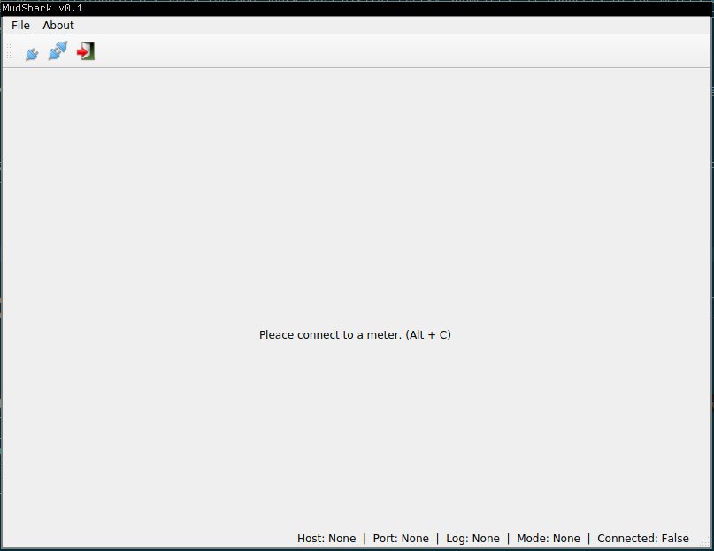
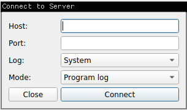
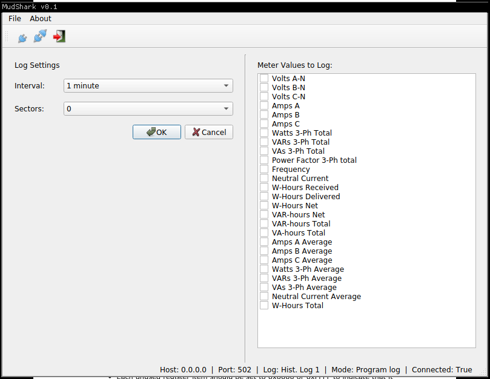

# MudShark Energy Meter Manager
A client built specifically around the ElectroIndustries Shark 200 and Shark 200S digital energy submeters. It connects to the meters via ModbusTCP, and allows the user to either retrieve log data from one of the meter's several logs, or reprogram one of the three historical logs. There is both a bare-bones implementation that can be used in the python interpreter or in a script, and a graphical interface. 

## Overview

The core functionality of this program (i.e. everything that actually talks to the meter) is located in client.py. gui.py is the main graphical interface, which utilizes the methods in client.py. connectWindow.py, programLogView.py, and retrieveLogView.py are all pyqt widgets used in gui.py. 

## Usage
### GUI wrapper
**NOTE: retrieving and viewing log data via the GUI wrapper has not been implemented yet! Only programming the historical logs is currently supported via the GUI.**
To start the GUI, at the command line enter:
```
python gui.py
```

You will be presented with this view:


Hit Alt+C or use the icon on the toolbar or File->Connect to connect to a meter. This must be done before anything else is possible. Once this occurs, a popup will appear:


Enter the host and port of the meter you wish to communicate with, along with the log you wish to interact with and the desired mode. There are two modes: program log, and retrieve log. Program log only works with the historical logs (1, 2, and 3), and allows you to set which values and at what intervals those values are recorded. Retrieve log mode allows you to poll the meter, retrieve the records stored for that particular log, and view them or export them from the menu.

** NOTE: Retrieve Log is not yet implemented in the GUI wrapper! **

#### Program Log via GUI
When program log is selected and the user clicks "Submit", the program will attempt to connect to the meter on the entered IP and port. If it is a successful connection, the main window's view will change:



On the right is a list of meter values you can log. On the left are two dropdown boxes. Interval determines the time interval at which the values selected on the right are recorded to the log. The sector dropdown box allows you to select the number of flash sectors allocated to this log. Each sector is 64kb, minus a sector header of 20 bytes. 15 sectors are available for allocation between all three historical logs. The sum of all sectors used by the three historical logs may be less than 15, but it cannot be greater. If the value is 0, that means that the log will be DISABLED.

#### Retrieve Log via GUI
** Retrieving the log via the GUI has not been implemented yet! **

### Bare-Bones Implementation